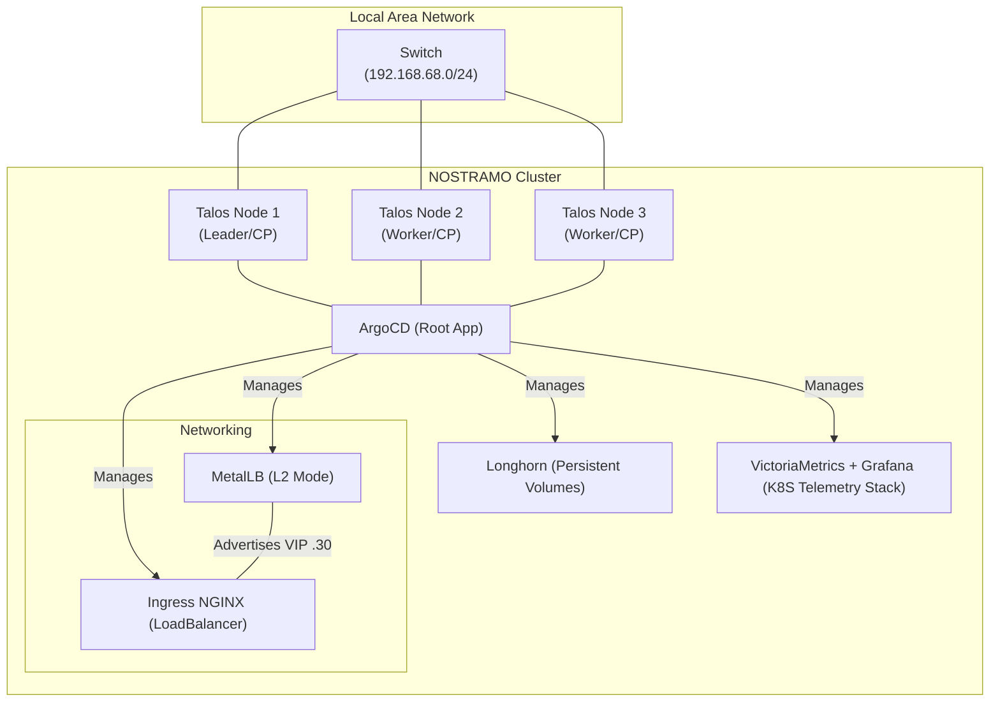

# 🦇 nostramo-lab
This serves as a GitOps repository for a bare-metal, hyper-converged, 3-node Talos K8S cluster.

### The Core Stack 📚
| Tool | Purpose | Key Feature(s) |
| --- | --- | --- |
| Talos Linux | Operating System | API-managed, immutable, K8S integration. |
| ArgoCD | GitOps | Automated self-healing, orchestration. |
| MetalLB | L2 Load Balancing | Interface-specific ARP advertisements. |
| Ingress NGINX | Ingress | External access management. |
| Longhorn | Storage | Persistent volume replication for high-availability. |
| VictoriaMetrics | Telemetry | Efficient storage for cluster telemetry. |
| Grafana | Observability | Real-time visualization of cluster telemtry. |

### Infrastructure as Code 📜
The Makefile in the root of the repo is used to bootstrap the cluster and pull ArgoCD.
ArgoCD then manages state and deployment by referencing the YAML manifests you can see right here in this repository.

To add and configure pods/services, additional Application manifests (which reference Helm charts) are commited into `apps/`. Supporting manifests are placed in `infrastructure/`

### Node Configuration ⚙️
Unfortunately, I cannot include my controlplane.yaml in the repo due to it containing a litany of private certificates/secrets/keys.

Here is a list of all of the alterations or additions I performed:

- `cluster.apiServer.extraArgs.enable-aggregator-routing: true`
  - Enables load-balancing for the two instances of metrics-server.
- `cluster.allowSchedulingOnControlPlanes: true`
  - Allows running workloads on control-plane nodes.
- `cluster.controlPlane.endpoint: https://192.168.1.x:6443`
  - Defines the endpoint for the leading node (the node that is bootstrapped in the Makefile).
- `cluster.clusterName: NOSTRAMO`
  - Sets a custom cluster name.
- `machine.install.disk: /dev/nvme0n1`
  - Sets the primary NVME as the installation disk.
- `machine.install.image: factory.talos.dev/metal-installer/your-unique-identifier`
  - Supplies the Talos image used for installation.
 
### Tooling 🧰
**Talos Node Debugger: `debugger.sh`**

Launches an interactive, highly privileged pod directly onto a targeted Kubernetes node. 

Specifically built for "break-glass" troubleshooting and low-level system administration on nodes where standard SSH access may be restricted or unavailable (such as Talos Linux). Cleans up after itself as well, terminating the pod upon exiting the session.

### Hardware & Costs 🔌
This lab was built on a tight budget, values are in USD:
- 3x Ryzen 3550H, 16GB DDR4, 512GB NVME: ~$600
- 1x TP Link 5-port 1Gbps Switch: $20

24 threads, 48GB RAM, and 1.5TB of high-speed storage.

Power consumption under load: **~150W**

