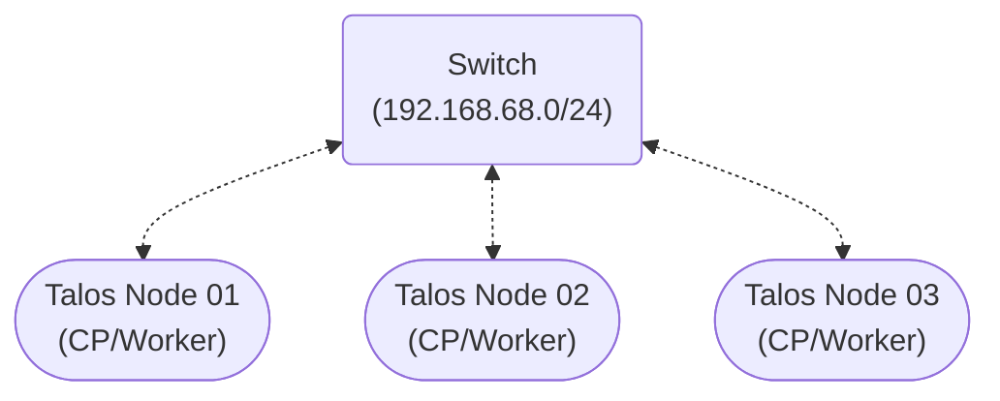

# 🦇 nostramo-lab
**A High-Availability, Hyper-Converged Kubernetes Cluster**

**nostramo-lab** is a 3-node, bare-metal Kubernetes cluster built on Talos Linux. It serves as a declarative environment for testing GitOps workflows and cloud-native networking.

### The Tech Stack 🛠️
| Layer | Tool| Rationale |
| --- | --- | --- |
| OS | [Talos Linux](https://docs.siderolabs.com/talos/) | Security-hardened, immutable, and purely API-driven. |
| GitOps | [ArgoCD](https://argo-cd.readthedocs.io/) | Maintains the cluster's desired state automatically by referencing this repo. |
| Network | [MetalLB](https://metallb.io/) | Bridges the gap between bare metal and K8S by advertising IPs via Layer 2 ARP. |
| Ingress | [Traefik](https://doc.traefik.io/traefik/) | Deployed as a DaemonSet for high availability, managing external traffic routing. |
| Storage | [Longhorn](https://longhorn.io/docs/what-is-longhorn/) | Provides high-availability storage with cross-node replication for stateful workloads. |
| Telemetry | [VictoriaMetrics](https://docs.victoriametrics.com/helm/victoria-metrics-k8s-stack/) | Chosen for its high efficiency and low resource footprint compared to Prometheus. |

### Infrastructure as Code 📜

#### GitOps Workflow:

**ArgoCD** manages the lifecycle of all services in the cluster by referencing the manifests committed to this repo. Sync waves are utilized to ensure that infrastructure (like MetalLB) is healthy before applications attempt to deploy.

Adding a service is as simple as committing a new Application manifest to the `apps/` directory. Supporting manifests are placed into subdirectories in `infrastructure/`.

#### Provisioning:

A Makefile automates the provisioning of the cluster itself, applying a declarative Talos manifest to each node and bootstrapping the cluster. Initial namespaces are created, secrets are instantiated, and ArgoCD is pulled into the cluster to begin deploying the infrastructure. All with a simple `make provision` command.

### Talos Node Configuration ⚙️

The Talos Linux image used includes several system extensions for compatibility:
- **amdgpu**: Firmware binaries and kernel modules for AMD GPUs.
- **amd-ucode**: Microcode update package for AMD CPUs.
- **iscsi-tools**: Makes remote storage appear like local disks. Needed by Longhorn.
- **realtek-firmware**: Provides realtek firmware binaries.
- **util-linux-tools**: Packages essential Linux utilities for use on Talos nodes.
- **i915**: Optional, for Intel GPU support.
- **intel-ucode**: Optional, mircrocode update package for Intel CPUs.

Drift is eliminated through the use of a Talos node manifest. The OS runs in RAM, meaning that every reboot returns the node to a known clean state. 

Here are three key modifications made to node configuration to facilitate the current architecture:
- `cluster.apiServer.extraArgs.enable-aggregator-routing: true`
  - Enables load-balancing for the two instances of metrics-server that are running within the cluster.
- `cluster.allowSchedulingOnControlPlanes: true`
  - Allows scheduling workloads on control-plane nodes. Vital for enabling workloads among the three converged nodes.
- `cluster.proxy.config.ipvs.strictARP: true`
  - Enforces stricter ARP handling to ensure service ClusterIPs are consistently mapped to a single MAC address. Needed for MetalLB.

### Tooling 🧰
**Talos Node Debugger: `debugger.sh`**

Because Talos is an immutable "no-SSH" OS, standard troubleshooting is restricted. This tool is developed to:
1) Launch a highly-privileged ephemeral pod on a target node.
2) Provide low-level access to the host namespaces for hardware/network debugging.
3) Automatically clean up all resources upon exit.

### Hardware & Efficiency 🔌
This lab demonstrates that enterprise features do not require enterprise budgets.
- **Compute:** 3x Ryzen 3550H (12 Cores / 24 Threads Total)
- **Memory:** 48GB DDR4 RAM
- **Storage:** 1.5TB NVME
- **Power Efficiency:** The entire cluster pulls **~150W** under heavy load.

